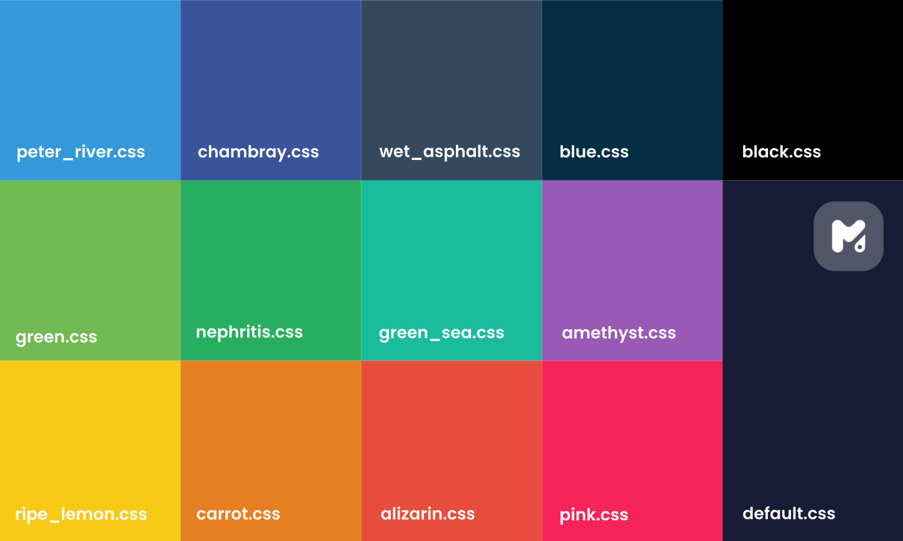
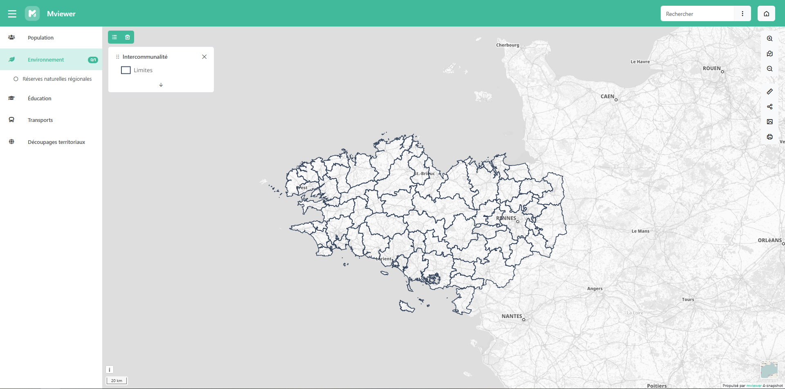
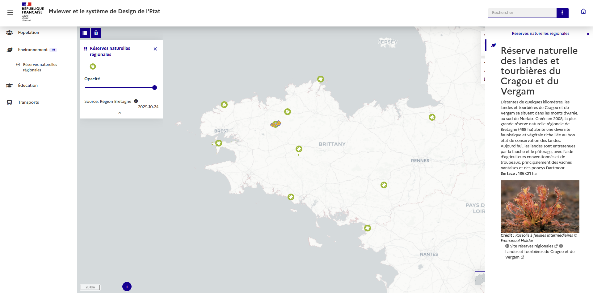
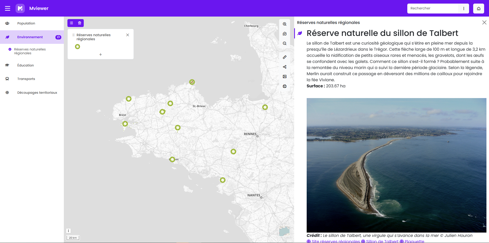
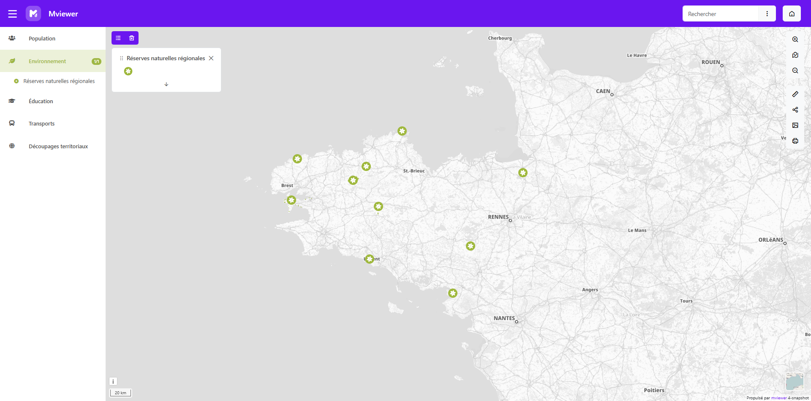

.. Authors : 
.. mviewer team
.. Gwendall PETIT (Lab-STICC - CNRS UMR 6285 / DECIDE Team)

.. _configcss:

Configurer – Apparence
======================

Mviewer utilise un style par défaut pour l’interface et ses composants. Il est toutefois possible de personnaliser l’apparence de votre application selon vos besoins : couleurs, polices, proportions des panneaux, etc.
Les sections suivantes décrivent les différentes méthodes de configuration.

Configurer un thème
-------------------

Le thème est configuré dans le fichier ``conf.xml`` de l’application, dans la balise ``<application>`` via le paramètre ``style`` ::

    <application
        title="Mon application"
        style="chemin/vers/mon/theme.css"
    />

Remarque
^^^^^^^^
• Le fichier renseigné doit pointer vers une feuille de style ``.css``.  
• Si aucun thème n’est spécifié, mviewer applique automatiquement : le thème par défaut ``css/themes/default.css``.

Les thèmes par défaut
---------------------

Pour modifier rapidement la couleur de l’interface, plusieurs thèmes prêts à l’emploi sont disponibles dans ``/css/themes/``.

Chaque fichier ``.css`` correspond à une variante colorée. 

 

Configurez simplement votre application avec le thème souhaité.

**Exemple** ::

    style="css/themes/green_sea.css"

Remarque
^^^^^^^^
• Un document de prévisualisation des thèmes est disponible dans le dossier : il présente le rendu de chacun des fichiers fournis.  
• Il est déconseillé de modifier directement ces fichiers. Pour créer votre propre style, référez-vous à *Créer un thème personnalisé*.

Le thème DSFR
-------------

.. warning::
    **Non compatible avec mviewer 4.0** - Pour utiliser le thème DSFR, vous devez rester sur la version **3.15** ou utiliser un thème par défaut.

Mviewer propose un thème dédié au **Design Système de l’État Français (DSFR)**, permettant d’appliquer facilement la charte graphique de l’administration.

Le thème reprend tous les codes et principes recommandés par le système de Design (DSFR) : couleurs, typographies.  
Pour des raisons techniques, les composants d'interface n'ont pas été remplacés par ceux proposés par la librairie DSFR mais sont stylisés dans le même esprit.  
Toutefois, la librairie est intégrée au thème : il est donc possible de mobiliser des éléments d'interface dans la page d'accueil, les customcontrols ou dans les templates.

Pour mobiliser ce thème au sein d'une application mviewer, configurez le fichier ``.xml`` comme ci-dessous ::

    <application
        logo='css/themes/theme-designfr/repfr-logo.png'
        favicon='css/themes/theme-designfr/dsfr-v1.6.0/dist/favicon/favicon.ico'
        style='css/themes/theme-designfr/theme_designfr.css'
    />

Les ressources du thème sont situées dans le dossier ``css/themes/theme-designfr``.

Optionnel
^^^^^^^^^

Si vous souhaitez mobiliser des éléments d’interface disponibles au sein de la librairie DSFR dans votre page d’accueil, templates ou customcontrols, insérez les scripts associés sous forme d’extensions mviewer ::

    <extensions>
        <extension type="javascript" src="css/themes/theme-designfr/dsfr-v1.6.0/dist/dsfr.module.min.js"/>
        <extension type="javascript" src="css/themes/theme-designfr/dsfr-v1.6.0/dist/dsfr.nomodule.min.js"/>
    </extensions>

Remarque
^^^^^^^^
• Un exemple est disponible dans ``demo/theme-designfr/theme-designfr.xml``  
• Ce thème n’est pas compatible avec toutes les options d’affichage (ex : templates “brut” ou certains plugins).  
• Le thème DSFR est fourni tel quel pour respecter les recommandations officielles ; il est déconseillé de le modifier.

Créer un thème personnalisé (mviewer ≥ 4)
-----------------------------------------
.. warning::
    Les thèmes créés pour mviewer 3.15 ou antérieur ne sont **pas compatibles** avec mviewer 4. Il est donc nécessaire de mettre à jour votre thème en suivant la procédure ci-dessous.

Depuis la version 4, les thèmes utilisent des **variables CSS globales**, ce qui permet une personnalisation simple et cohérente sans modifier les composants.

Créez un fichier CSS, par exemple : ``apps/monapp/montheme.css``

Définissez ensuite les variables que vous souhaitez personnaliser (voir le détail ci-après).

**Exemple 1** ::

    @import url('https://fonts.googleapis.com/css2?family=Poppins:ital,wght@0,100;0,200;0,300;0,400;0,500;0,600;0,700;0,800;0,900;1,100;1,200;1,300;1,400;1,500;1,600;1,700;1,800;1,900&display=swap');
    :root {
      --mvcustom-color-primary: #6610f2;
      --mvcustom-font: 'Poppins', sans-serif;
      --mvcustom-rightpanel-size: 40%;
    }

*Ici : couleur principale violette, police Poppins et panneau d'information occupant 40 % de l’écran.*

**Exemple 2 — Thème bicolore** ::

    :root {
      --mvcustom-color-primary: #6610f2;
      --mvcustom-color-secondary: #9fb83d;
    }

*Dans cet exemple, la couleur principale est violette mais le menu des thématiques utilise une couleur secondaire (ici vert).*

Remarque
^^^^^^^^
• Un exemple complet est disponible ici : https://github.com/mviewer/mviewer-demo/blob/main/customtheme/customstyle.css  
  et dans ``demo/customtheme.xml``  
• Seules les variables souhaitées doivent être ajoutées ; les autres conservent les valeurs par défaut.  
• Ajoutez vos styles spécifiques après les variables globales si nécessaire.

Les variables globales
----------------------

Le bloc ``:root`` contient toutes les variables CSS permettant de personnaliser l’apparence de votre application mviewer.  
Ces variables rendent le thème facilement modifiable et cohérent, sans avoir à intervenir dans chaque composant.

**Couleurs**

* ``--mvcustom-color-primary`` : couleur principale de l’application (code HEX)
* ``--mvcustom-color-secondary`` : couleur secondaire (thème bicolore) (code HEX)

**Police**

* ``--mvcustom-font`` : police principale
💡 *Astuce : n’oubliez pas d’importer la police via @import ou @font-face.*

**Bordures**

* ``--mvcustom-border-radius`` : arrondi des composants (``0`` = bords carrés, ``5px`` ou plus = coins arrondis)

**Taille des fenêtres d'interrogation**

* ``--mvcustom-rightpanel-size`` : largeur du panneau droit (en ``%`` ou ``px``)
* ``--mvcustom-bottompanel-size`` : hauteur du panneau inférieur (en ``%`` ou ``px``)

**Navbar (barre de navigation)**

* ``--mvcustom-navbar-h`` : hauteur de la navbar (px)
* ``--mvcustom-navbar-color`` : couleur du texte et des icônes (HEX)
* ``--mvcustom-navbar-colorbody`` : couleur de fond (HEX)

Remarques
^^^^^^^^^

• Les variables sont compatibles avec les plugins communautaires et les composants Bootstrap 5 (ex : bouton).  
• Les variables peuvent être réutilisées partout dans vos fichiers mviewer (accueil, template, etc.) via ``var(--nom-de-la-variable)``.  
• Modifier ces valeurs permet de changer rapidement et de manière cohérente l’apparence de toute l’application.